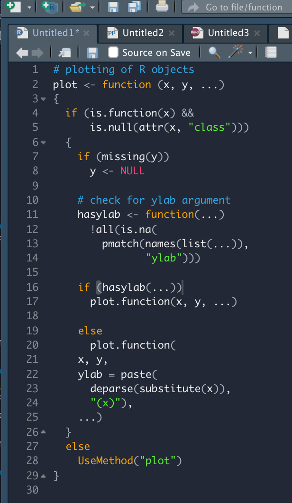

# codethemes
My texmate code themes, mainly intended for RStudio.

Currently there is only one theme I called *SK Dark*, which to me works better and fits more nicely with the IDE than the Cobalt theme built into RStudio. If you find this useful, feel free to give feedback or propose refinements. 

SK Dark                    |  Cobalt
:-------------------------:|:-------------------------:
            |  

