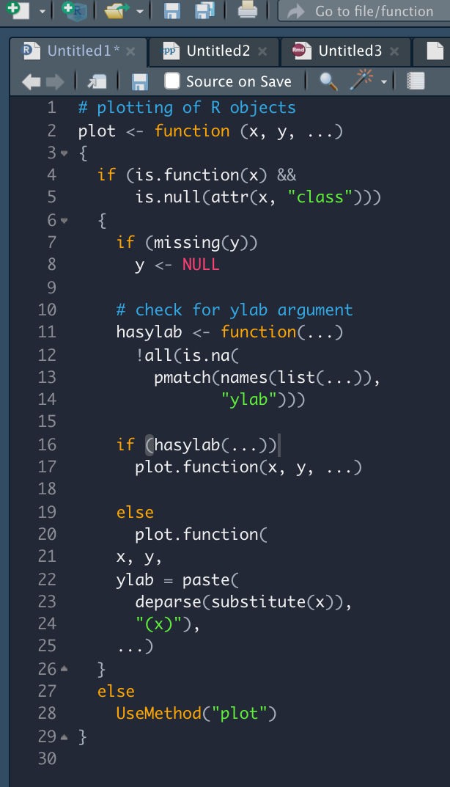
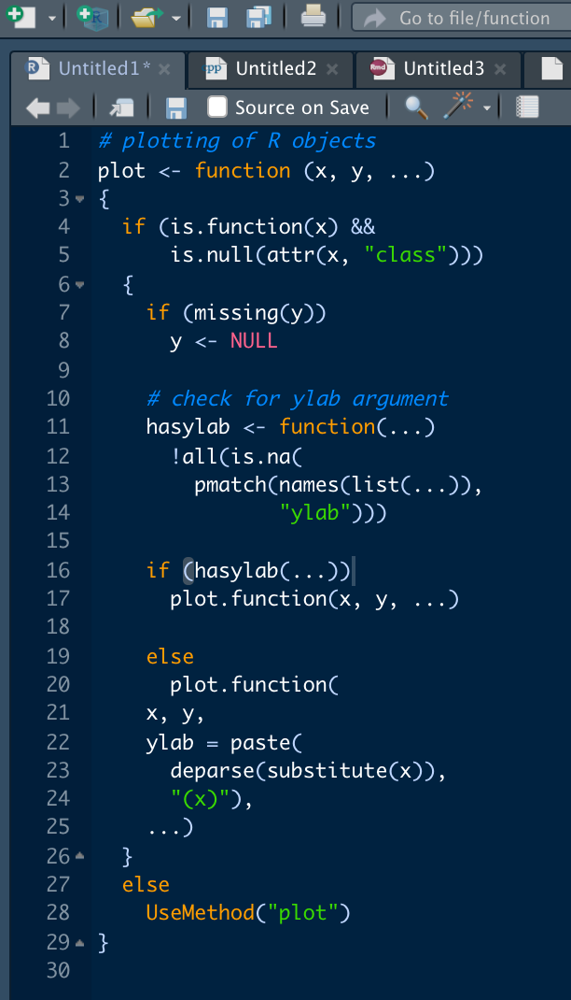

# codethemes
 TexMate code themes, inspired by *fastverse* colours, mainly intended for RStudio.

These themes are meant to constitute an improvement over the *Cobalt* theme built into RStudio. I'm working on a light version. If you find this useful, feel free to give feedback or propose refinements. 

Fastverse Dark             |  Cobalt
:-------------------------:|:-------------------------:
    |  

