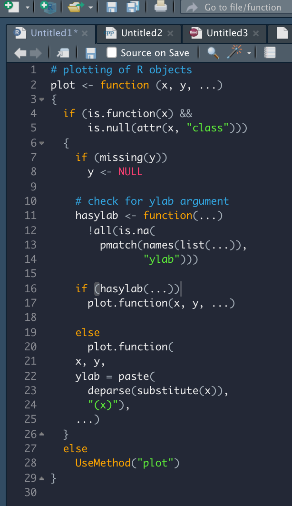
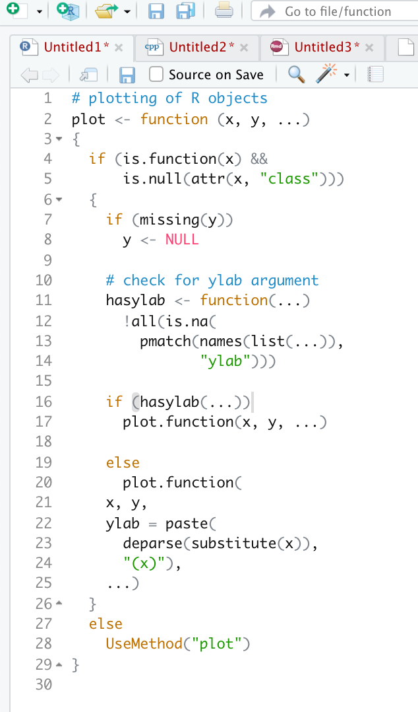

# codethemes
TexMate code themes, inspired by [*fastverse*](<https://github.com/fastverse/fastverse>) colours, mainly intended for the RStudio IDE.

These themes are meant to improve a bit over the (light) *textmate* and (dark) *cobalt* themes built into RStudio. Both themes come with a version that has italic comments (as in *cobalt*). There is also a variant of each theme that uses a brighter magenta colour for markdown code (instead of dark blue). If you find these themes useful, feel free to give feedback or propose refinements. 

Fastverse Dark                  |  Cobalt
:------------------------------:|:-------------------------:
    |  

Fastverse Light                  |  Textmate (default)
:------------------------------:|:-------------------------:
    |  
